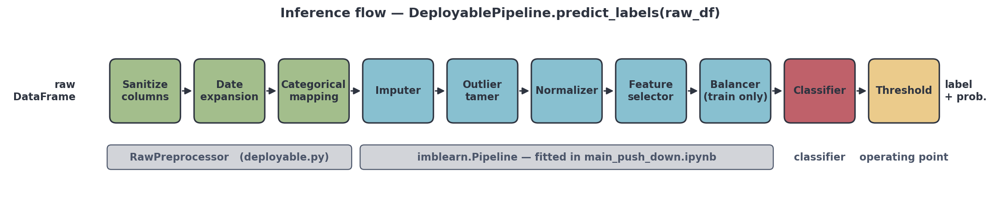
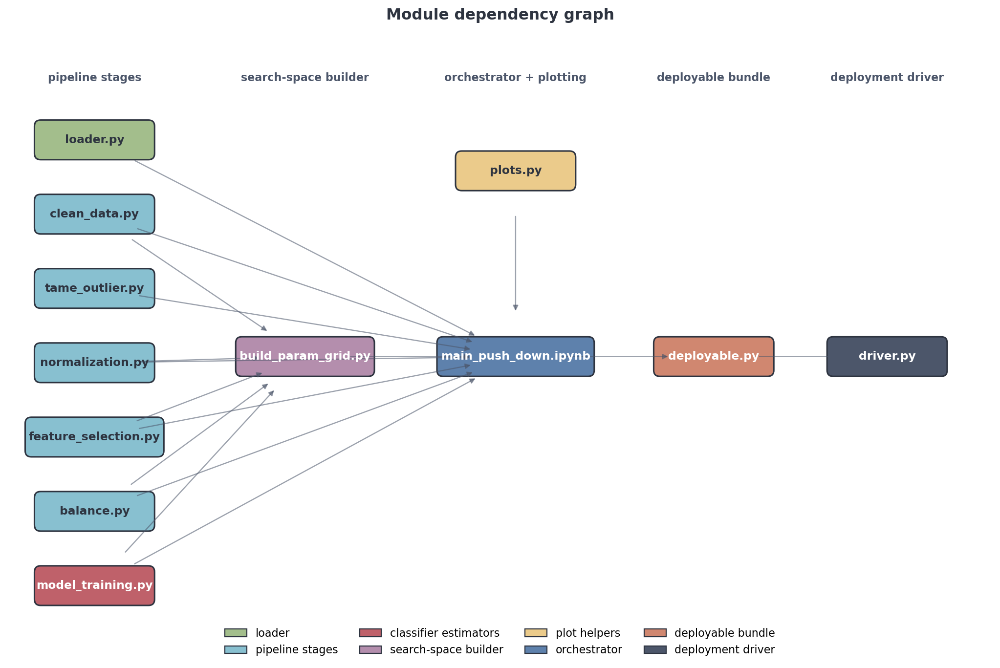
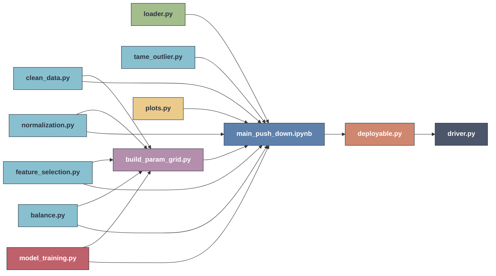
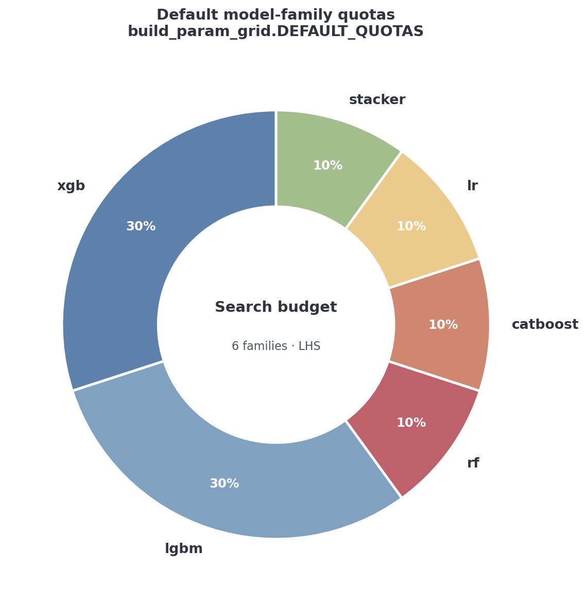
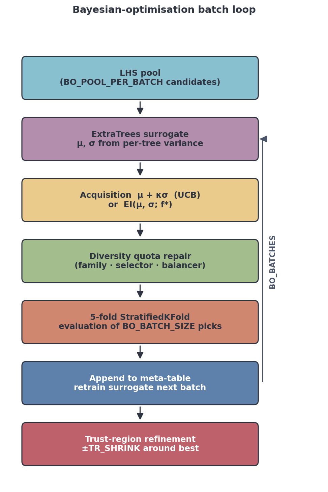
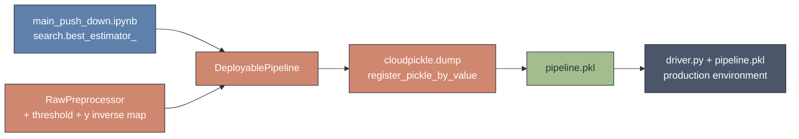

# Medical Framework

A modular AutoML framework for binary classification on tabular clinical data.
It composes a six-stage `imblearn.Pipeline`, drives it through a Latin-Hypercube
+ family-quota search, distils the results into a surrogate-modelled
hyperparameter landscape, refines that landscape with diversity-aware Bayesian
optimisation, gates the survivor through repeated-CV stability testing, and
finally serialises everything — including the raw-DataFrame preprocessing — into
a single self-contained `.pkl` that a thirty-line deployment script can run on
an unseen CSV.

---

## Inference flow



The pipeline that ships to production is logically three regions:

| Region | Owner | Purpose |
|---|---|---|
| Sanitise columns → Date expansion → Categorical mapping | `RawPreprocessor` in `deployable.py` | Bring a raw incoming DataFrame to the exact numeric schema the model was trained on. |
| Imputer → Outlier tamer → Normalizer → Feature selector → Balancer | fitted `imblearn.Pipeline` | The five-stage transformer chain selected by the search. The balancer is active only during `.fit_resample` and is a pass-through at predict time. |
| Classifier → Threshold | the winning estimator + tuned operating point | Returns a probability and an integer/label decision at the F1-optimal cut. |

The whole chain is wrapped by `DeployablePipeline`, whose public surface is
`predict_proba(df)`, `predict(df)`, and `predict_labels(df)`.

---

## Module dependency graph





---

## Module reference

| File | Role |
|---|---|
| `loader.py` | Reads CSV/XLSX, drops columns with > 10 % missingness, sanitises column names, expands date columns (gregorian or jalali) into year/month/day/dow/hour/doy/is_weekend features, learns the categorical → integer mapping, returns `(X, Y, all_mappings, y_mappings)`. |
| `clean_data.py` | Sklearn `TransformerMixin` imputers: `MeanImputer`, `ClassMeanImputer`, `InterpolateImputer`, `KNNImputerWrapper`, `IterativeModelImputer`. |
| `tame_outlier.py` | `OutlierTamer` — composable *detector* (`iforest` / `cluster` / `statistical`) × *remediation* (`winsorize` / `percentile_clip` / `mad_replace` / `cluster_local_median` / `shrink` / `none`) with shared statistics and an optional metadata channel for explanations. |
| `normalization.py` | `ZScoreNormalizationNorm` and `RobustScalerNorm` thin wrappers around `StandardScaler` / `RobustScaler` that preserve column names and indices. |
| `feature_selection.py` | `SelectKBestFilter` (ANOVA F-test) and `TreeBasedSelection` (ExtraTrees + `SelectFromModel`). |
| `balance.py` | imblearn-compatible samplers: `SMOTESampler` and `BorderlineSMOTESampler`. The notebook uses `FunctionSampler(_identity)` as the no-op baseline. |
| `model_training.py` | Classifier wrappers with `(ClassifierMixin, BaseEstimator)` MRO and explicit `_estimator_type = "classifier"`: `LogisticRegressionEstimator`, `RandomForestEstimator`, `XGBoostEstimator`, `LightGBMEstimator`, `CatBoostEstimator`. |
| `build_param_grid.py` | Latin-Hypercube + per-family-quota search space builder. `build_param_grid(spw_base, total_n)` returns `(param_grid, family_index)`. `diversity_report(...)` audits entropy and continuous spread before fitting. |
| `plots.py` | EDA + result plotting helpers: `plot_histograms_grouped`, `plot_pie_chart`, `plot_heatmap`, `calculate_p_values` + `format_p_values_table`, `plot_confusion_matrix_roc`, `SHAP`. |
| `main_push_down.ipynb` | Orchestrator. Drives load → split → EDA plots → search → winner inspection → result plots → surrogate analysis → BO → final stability → persist. |
| `deployable.py` | `RawPreprocessor`, `DeployablePipeline`, `save_deployable`, `load_deployable`. The serialiser registers every framework module with cloudpickle's by-value protocol so the resulting `.pkl` is self-contained. |
| `driver.py` | Standalone CLI: `python driver.py <test.csv> [pipeline.pkl]`. Imports only `cloudpickle` and `pandas`. |

---

## Pipeline stages — what each step does


| # | Stage | Implementations the search can pick |
|--:|---|---|
| 1 | **Imputer** | `MeanImputer`, `ClassMeanImputer`, `InterpolateImputer`, `KNNImputerWrapper`, `IterativeModelImputer` |
| 2 | **Outlier tamer** | `OutlierTamer` (3 detectors × 6 remediations × continuous knobs) |
| 3 | **Normalizer** | `ZScoreNormalizationNorm`, `RobustScalerNorm` |
| 4 | **Feature selector** | `SelectKBestFilter(k ∈ {10,20,30,40})`, `TreeBasedSelection` |
| 5 | **Balancer** | identity passthrough (`FunctionSampler`), `SMOTESampler(k=3,5)`, `BorderlineSMOTESampler(k=3)` |
| 6 | **Classifier** | `LogisticRegressionEstimator`, `RandomForestEstimator`, `XGBoostEstimator`, `LightGBMEstimator`, `CatBoostEstimator`, calibrated stacker over `{xgb, lgbm, lr}` |

Every step is a real sklearn transformer with named-column awareness, so the
column-naming contract holds through the full chain — important for downstream
SHAP and permutation-importance attribution.

---

## Hyperparameter search

`build_param_grid` pre-samples a fixed number of full pipeline configurations
(default `total_n = 200`) using **Latin Hypercube Sampling** under **per-family
quotas**. Every dict in the returned grid pins one full configuration with
every value wrapped in a length-1 list, so `GridSearchCV` evaluates each
exactly once.



`diversity_report` is called before any fit to verify the assembled grid is
actually diverse:

* categorical entropy `H ∈ [0, 1]` per axis (imputer, normalizer, detector,
  remediation, selector, balancer, family, …) — anything below `0.80` is
  flagged;
* continuous spread per axis (min / max / std) over only the candidates that
  actually sample it.

The search then runs as `GridSearchCV(refit='pr_auc')` with
`StratifiedKFold(5, shuffle=True)` and dual scoring (`pr_auc`, `roc_auc`).
A post-search audit surfaces silent NaN scores and prints the PR-AUC
dispersion across candidates — the metric that tells you whether the wider
search actually produced wider results.

---

## Surrogate modelling

Once the meta-table is frozen (one row per evaluated configuration with
encoded categoricals, continuous knobs, and multi-output targets including
`mean_pr_auc`, `std_pr_auc`, `range_pr_auc`, `cv_pr_auc`, and an
uncertainty-aware composite `mean − 0.5·std`), five candidate surrogates are
fit and compared:

| Surrogate | Notes |
|---|---|
| LightGBM regressor | gradient-boosted trees |
| XGBoost regressor | gradient-boosted trees |
| RandomForest regressor | bagging variance proxy |
| ExtraTrees regressor | bagging with extra randomisation (also reused for BO acquisition) |
| Gaussian Process regressor | Matern 2.5 + WhiteKernel, length-scale-aware uncertainty |

Selection criterion: **Spearman ρ** from 5-fold CV — ranking consistency
matters more than raw R² because the surrogate's job is to pick the right
order, not to regress absolute scores. The winner is then used to draw a
predicted-vs-observed calibration plot, a permutation-importance ranking
(`n_repeats=20`) for noise-dimension detection, and — if `shap` is installed —
a `|SHAP|` summary.

---

## Bayesian optimisation



Staged batches with surrogate retraining between each batch:

1. **LHS pool** of `BO_POOL_PER_BATCH` candidates from `build_param_grid`.
2. **ExtraTrees surrogate** fit on the running meta-table; mean and std are
   read from the per-tree predictions (a free Monte-Carlo proxy for σ).
3. **Acquisition** — UCB `μ + κσ` (default) or EI; both available via
   `BO_ACQUISITION`.
4. **Diversity-quota repair** — after greedy top-by-acquisition selection,
   swap in under-represented family / selector / balancer slots until the
   minimum quotas (`BO_FAMILY_MIN_FRACTION`, etc.) are satisfied. The batch
   never collapses onto a single regime.
5. **5-fold CV evaluation** of the selected `BO_BATCH_SIZE` candidates with
   `error_score=np.nan` so pathological combos don't poison the run.
6. **Append + retrain** the surrogate for the next batch.
7. **Trust-region refinement** after the last batch: categoricals pinned to
   the best config, continuous ranges contracted to `±TR_SHRINK` around the
   best value (log-aware), then `TR_N` extra samples are evaluated.

The objective throughout is the uncertainty-aware composite
`mean_pr_auc − 0.5·std_pr_auc`, not raw PR-AUC — threshold robustness
matters more than peak score on imbalanced data.

---

## Final stability evaluation

Top-K survivors from BO (or, if BO was skipped, from the exploration sweep)
are re-evaluated with `RepeatedStratifiedKFold(n_splits=5, n_repeats=3)`.
For each candidate the gate records:

* PR-AUC mean & std across all repeats,
* Brier score (calibration),
* Recall at Specificity ≥ 0.90 (clinically meaningful operating point),
* Best-F1 threshold mean & std across folds (threshold stability).

A stability-aware composite
`pr_auc_mean − 0.5·pr_auc_std − 0.5·brier_mean` picks the winner, which is
then refit on the full training split and persisted alongside its
recomputed holdout thresholds.

---

## Deployment



`save_deployable` calls `cloudpickle.register_pickle_by_value` on every
framework module before dumping the bundle, so the resulting `pipeline.pkl`
carries its own class definitions. The deployment environment needs only:

```
numpy
pandas
scikit-learn
imbalanced-learn
xgboost      # if winner is XGBoost
lightgbm     # if winner is LightGBM
catboost     # if winner is CatBoost
cloudpickle
jdatetime    # if jalali dates may appear at inference
```

…plus the tiny `driver.py`:

```bash
python driver.py path/to/test.csv path/to/pipeline.pkl
```

Internally:

```python
import cloudpickle, pandas as pd

with open('pipeline.pkl', 'rb') as f:
    pipe = cloudpickle.load(f)

raw = pd.read_csv('test.csv', sep=None, engine='python',
                  na_values=[' ', '', 'NA', 'NaN'])

labels      = pipe.predict_labels(raw)   # original class strings
probas      = pipe.predict_proba(raw)    # P(class)
ints        = pipe.predict(raw)          # 0/1 using the embedded threshold
```

No framework `.py` file is required at the deployment site.

---

## File layout

```
Medical-Framework/
├── loader.py
├── clean_data.py
├── tame_outlier.py
├── normalization.py
├── feature_selection.py
├── balance.py
├── model_training.py
├── build_param_grid.py
├── plots.py
├── deployable.py             # RawPreprocessor + DeployablePipeline + save_deployable
├── driver.py                 # standalone deployment script
├── main_push_down.ipynb      # orchestrator
├── docs/                     # README figures
│   ├── pipeline_flow.png
│   ├── module_graph.png
│   ├── family_quotas.png
│   └── bo_loop.png
└── requirements.txt
```

---

## Quick start

```bash
# 1. install dependencies
pip install -r requirements.txt

# 2. open the orchestrator and run the cells top-to-bottom
jupyter notebook main_push_down.ipynb

# 3. once the search finishes the persist cell writes pipeline.pkl;
#    use it from anywhere with the driver:
python driver.py path/to/unseen.csv ./Final/pipeline.pkl
```

The orchestrator is staged so that heavy steps (Bayesian optimisation, final
stability evaluation) are gated behind `RUN_BO` and `RUN_FINAL_EVAL` flags —
exploration and reporting cells run end-to-end without them.

---

## Design notes

* **Mixin order matters.** Every classifier wrapper has
  `(ClassifierMixin, BaseEstimator)` in that exact MRO order and an explicit
  `_estimator_type = "classifier"`. Without this, sklearn ≥ 1.6 treats the
  estimator as a regressor and every `roc_auc` / `average_precision` scorer
  raises inside CV — silently producing NaN scores across the entire sweep.
* **No row dropping inside a `Pipeline`.** Imputers that change `n_samples`
  break sklearn's `(X, y)` invariant. Use `imblearn`'s `FunctionSampler` if
  you really need it; otherwise impute in place.
* **cloudpickle by value.** Bundling without it would force the deployment
  environment to import every framework module from disk — adding a fragile
  dependency between the production site and the training repo.
* **Uncertainty-aware objective.** Peak PR-AUC is a poor optimisation target
  on imbalanced data because tiny fold-to-fold instability can flip the
  best-threshold decision. Optimising `mean − λ·std` (with `λ = 0.5`)
  prefers slightly lower-mean configurations that hold their score across
  folds.
* **Diversity quotas during BO.** Without minimum family/selector/balancer
  quotas the optimiser collapses onto a single regime after one or two
  batches, which destroys the surrogate's ability to estimate uncertainty
  in under-explored regions. The repair step is cheap insurance.
